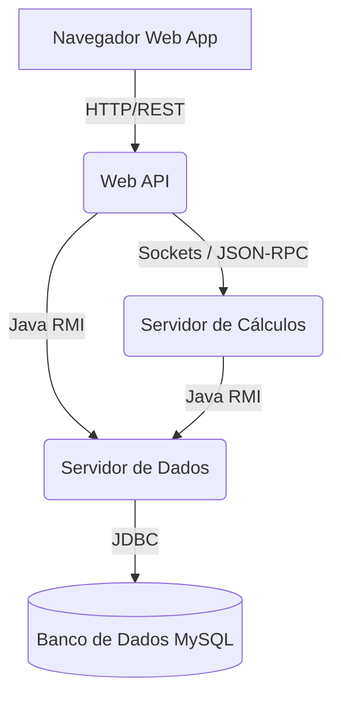

# Opiniões e Respostas - Atividade 5

1. **Qual tecnologia de comunicação o servidor de cálculo utiliza?**
O servidor de cálculo utiliza Sockets TCP brutos para disponibilizar o serviço de folha de pagamento, e também atua como cliente consumindo RMI (Remote Method Invocation) do servidor de dados.

2. **Qual protocolo de mensagem o servidor de cálculo utiliza?**
Utiliza o protocolo JSON-RPC, padronizando a chamada remota de métodos utilizando JSON via socket.

3. **Qual tecnologia de comunicação o servidor de cálculo utiliza?**
*(Pergunta repetida no README)* - A comunicação de entrada é via Socket TCP, e a de saída para o banco de dados é via Java RMI.

4. **Qual estilo arquitetural o projeto web api implementou para expor suas funcionalidades?**
A Web API implementa uma arquitetura baseada no estilo REST (Representational State Transfer), expondo as funcionalidades dos sistemas legados ou distribuídos através de endpoints HTTP utilizando o Spring Boot (Controller-Service pattern).

5. **Arquitetura do Sistema**
> **Atenção:** Você mesmo precisa criar uma imagem (no Paint ou Diagrams) e salvar como `ARQUITETURA.png` na raiz do projeto. Eu criei um diagrama base abaixo para você usar de inspiração.

